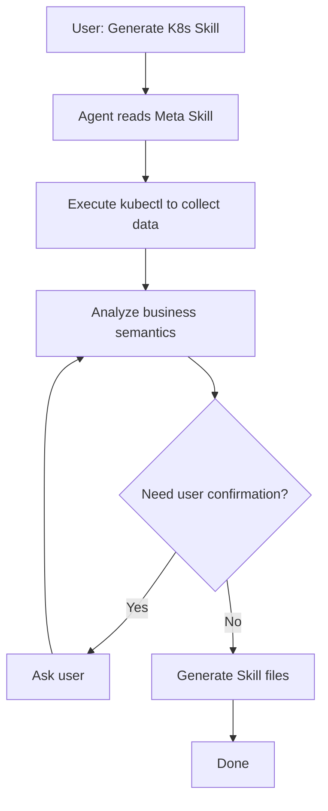

# K8s Skill Generator

> Version: 1.0.0 | [中文文档](README_zh.md)

A **Meta Skill** that guides AI coding agents (Cursor, Windsurf, Claude Code, Cline, etc.) to generate customized operations Skills for K8s clusters.

## Design Philosophy

**Use Skill to generate Skill** — No code, pure Skill-driven.

The core insight: AI coding agents are already LLMs that can execute commands, analyze output, and create files. We don't need to write code — we just need to tell them *how to do it* via structured Markdown.

### Core Concept: Meta Skill

```
Traditional approach:  Code → calls LLM API → generates docs
This approach:         Skill (Markdown) → guides Agent → generates Skill (Markdown)
```

The Generator itself is a Skill. It teaches the Agent how to build other Skills. No Python, no API calls, no build pipeline — just Markdown instructing an LLM.

### Architecture: Three-Layer Design

```
┌─────────────────────────────────────────────────────┐
│                   SKILL.md                          │
│              (Orchestration Layer)                   │
│         Defines the generation workflow             │
│         Step 1 → Step 2 → ... → Step 6             │
└──────────┬──────────────────────────┬───────────────┘
           │                          │
           ▼                          ▼
┌─────────────────────┐   ┌─────────────────────────┐
│   discovery/        │   │   templates/             │
│  (Data Layer)       │   │  (Presentation Layer)    │
│                     │   │                          │
│  cluster-info.md    │   │  SKILL.md.template       │
│  namespaces.md      │   │  operations/             │
│  monitoring.md      │   │    core.md.template      │
│  credentials.md     │   │    monitoring.md.template│
│                     │   │    logging.md.template   │
└─────────────────────┘   └─────────────────────────┘
```

- **Orchestration Layer** (`SKILL.md`) — The conductor. Defines *what* to do and *in what order*. Agent reads this first and follows it step by step.
- **Data Layer** (`discovery/`) — The eyes. Each file teaches the Agent *how to collect* a specific category of cluster data via kubectl commands, and *how to structure* the result.
- **Presentation Layer** (`templates/`) — The hands. Defines the shape of the output. Agent fills in templates with collected data to produce the final Skill files.

### Design Principles

| Principle | How it's applied |
|-----------|-----------------|
| **Do one thing well** (Unix) | Each discovery file collects one category; each template generates one module |
| **Separation of concerns** | Collection logic, orchestration logic, and output format are in separate files |
| **Human-in-the-loop** | Agent must confirm business semantics and write operations with user before proceeding |
| **Security by default** | Credentials are never stored as values — only retrieval commands are generated |
| **Convention over configuration** | Sensible defaults (output path, enabled modules) reduce the questions Agent needs to ask |
| **Open for extension** | Adding a new module = 1 discovery file + 1 template file. No orchestration changes needed |

### Data Flow

```
kubectl commands ──→ Raw cluster data ──→ Structured YAML (in Agent memory)
                                              │
                              ┌───────────────┼───────────────┐
                              ▼               ▼               ▼
                        Cluster info    Namespace info   Component info
                              │               │               │
                              ▼               ▼               ▼
                    ┌─────────────────────────────────────────────┐
                    │         User confirmation & enrichment       │
                    │   (business purpose, criticality, etc.)      │
                    └─────────────────────────────────────────────┘
                                          │
                                          ▼
                              Template variable filling
                                          │
                                          ▼
                              Generated Skill files (.md)
```

The key difference from traditional tools: *the Agent itself is the processing engine*. There's no code transforming data — the LLM reads the raw kubectl output, understands the business context, and produces human-readable documentation.

### Why Not Code?

| Concern | Code approach | Skill approach |
|---------|--------------|----------------|
| Parsing kubectl output | Write parsers for each format | Agent understands JSON/YAML natively |
| Business semantics | Impossible to infer programmatically | LLM excels at semantic analysis |
| Edge cases | Need explicit handling for each | Agent adapts on the fly |
| User interaction | Build CLI/UI | Agent has natural language dialogue built-in |
| Maintenance | Update code, test, deploy | Edit a Markdown file |

## Directory Structure

```
k8s-skill-generator/
├── SKILL.md                        # Main entry: generation flow guide
├── README.md                       # English documentation
├── README_zh.md                    # Chinese documentation
├── .gitignore                      # Git ignore rules
├── discovery/                      # Data collection guides
│   ├── cluster-info.md             # Cluster basic info collection
│   ├── namespaces.md               # Namespace analysis
│   ├── monitoring.md               # Monitoring component discovery
│   └── credentials.md              # Credential handling
├── templates/                      # Output templates
│   ├── SKILL.md.template           # Generated Skill main file template
│   └── operations/                 # Operation doc templates
│       ├── core.md.template        # Core resource operations
│       ├── monitoring.md.template  # Monitoring operations
│       └── logging.md.template     # Logging operations
└── examples/                       # Example output
    └── sample-skill/               # A generated sample
```

## Usage

### 1. Install this Skill

Make the entry file accessible to your Agent. Example for Cursor:

```bash
# Method 1: Copy
cp -r k8s-skill-generator ~/.cursor/skills/

# Method 2: Symlink (recommended, easier to update)
ln -s $(pwd)/k8s-skill-generator ~/.cursor/skills/k8s-skill-generator
```

For other agents (Windsurf, Claude Code, Cline, etc.), follow their respective Skill/plugin directory conventions.

### 2. Trigger Generation

Chat with Agent:

```
User: Help me generate a K8s Skill for the current cluster
```

Or specify context:

```
User: Generate K8s Skill for production context
```

### 3. Interactive Generation

Agent will:

1. **Check cluster access** — Execute `kubectl cluster-info`
2. **Collect cluster info** — Version, nodes, CNI, installed components
3. **Analyze namespaces** — List namespaces and their contents
4. **Ask for confirmation** — Confirm business namespace purpose descriptions
5. **Generate Skill** — Generate customized Skill files based on templates

### 4. Output

Default output to `.cursor/skills/k8s-{context}/`:

```
.cursor/skills/k8s-production/
├── SKILL.md                    # Main entry
└── operations/                 # Operation docs
    ├── core.md                 # Core resource operations
    ├── monitoring.md           # Monitoring operations (if available)
    └── logging.md              # Logging operations (if available)
```

## Workflow



## Key Features

| Feature | Description |
|---------|-------------|
| Zero Code | Pure Skill/Markdown, no coding required |
| Interactive | Dialogue with user to confirm, generates more accurate descriptions |
| Auto-discovery | Automatically gets cluster info via kubectl |
| LLM Analysis | Agent itself analyzes business semantics |
| Secure | No plaintext credentials stored, only generates retrieval commands |

## Customization

### Add New Operation Template

Create new template under `templates/operations/`:

```
templates/operations/my-module.md.template
```

### Modify Discovery Logic

Edit corresponding files under `discovery/`.

### Adjust Generation Flow

Edit the main `SKILL.md` file.

## Examples

Check `examples/sample-skill/` directory to see what generated Skills look like.

## Comparison with Python Tool Approach

| Aspect | Python Tool | Meta Skill |
|--------|-------------|------------|
| Implementation | Need to write code | Just write Markdown |
| LLM | Need to call API | Agent itself is LLM |
| Interaction | CLI arguments | Dialogue interaction |
| Flexibility | Fixed logic | Adjustable on the fly |
| Maintenance | Code maintenance | Doc maintenance |

## License

MIT
