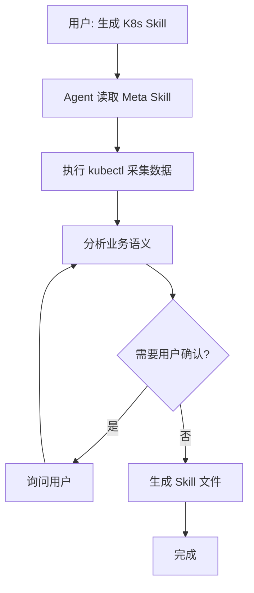

# K8s Skill 生成器

> 版本: 1.0.0

一个 **Meta Skill**，引导 AI 编程助手（Cursor、Windsurf、Claude Code、Cline 等）为 K8s 集群生成定制化的运维 Skill。

## 设计理念

**用 Skill 生成 Skill** —— 零代码，纯 Skill 驱动。

核心洞察：AI 编程助手内置的 Agent 本身就是能执行命令、分析输出、创建文件的 LLM。我们不需要写代码 —— 只需要通过结构化的 Markdown 告诉它*怎么做*。

### 核心概念：Meta Skill

```
传统方式:  代码 → 调用 LLM API → 生成文档
本项目:    Skill (Markdown) → 引导 Agent → 生成 Skill (Markdown)
```

生成器本身就是一个 Skill。它教会 Agent 如何构建其他 Skill。不需要 Python，不需要 API 调用，不需要构建流水线 —— 只是用 Markdown 指导 LLM。

### 架构：三层设计

```
┌─────────────────────────────────────────────────────┐
│                   SKILL.md                          │
│                (编排层 / Orchestration)               │
│             定义生成工作流                             │
│         步骤 1 → 步骤 2 → ... → 步骤 6               │
└──────────┬──────────────────────────┬───────────────┘
           │                          │
           ▼                          ▼
┌─────────────────────┐   ┌─────────────────────────┐
│   discovery/        │   │   templates/             │
│  (数据层 / Data)     │   │  (展现层 / Presentation) │
│                     │   │                          │
│  cluster-info.md    │   │  SKILL.md.template       │
│  namespaces.md      │   │  operations/             │
│  monitoring.md      │   │    core.md.template      │
│  credentials.md     │   │    monitoring.md.template│
│                     │   │    logging.md.template   │
└─────────────────────┘   └─────────────────────────┘
```

- **编排层** (`SKILL.md`) —— 指挥者。定义*做什么*以及*按什么顺序做*。Agent 首先读取这个文件，然后按步骤执行。
- **数据层** (`discovery/`) —— 眼睛。每个文件教会 Agent *如何采集*特定类别的集群数据，以及*如何组织*采集结果。
- **展现层** (`templates/`) —— 双手。定义输出的形状。Agent 用采集到的数据填充模板，生成最终的 Skill 文件。

### 设计原则

| 原则 | 如何体现 |
|------|---------|
| **只做好一件事** (Unix 哲学) | 每个 discovery 文件只采集一类数据；每个模板只生成一个模块 |
| **关注点分离** | 采集逻辑、编排逻辑、输出格式分别放在不同文件中 |
| **用户确认优先** | Agent 在执行写操作或确定业务语义前，必须先征得用户同意 |
| **默认安全** | 凭据永远不会以明文值存储 —— 只生成获取凭据的命令 |
| **约定优于配置** | 合理的默认值（输出路径、启用模块）减少 Agent 需要询问的问题 |
| **开放扩展** | 新增模块 = 1 个 discovery 文件 + 1 个模板文件，无需修改编排逻辑 |

### 数据流转

```
kubectl 命令 ──→ 原始集群数据 ──→ 结构化 YAML（Agent 记忆中）
                                        │
                          ┌─────────────┼─────────────┐
                          ▼             ▼             ▼
                     集群信息      命名空间信息     组件信息
                          │             │             │
                          ▼             ▼             ▼
                ┌───────────────────────────────────────────┐
                │          用户确认 & 语义丰富                 │
                │    （业务用途、重要性等级等）                  │
                └───────────────────────────────────────────┘
                                      │
                                      ▼
                            模板变量填充
                                      │
                                      ▼
                          生成的 Skill 文件 (.md)
```

与传统工具的关键区别：*Agent 本身就是处理引擎*。没有代码做数据转换 —— LLM 直接读取 kubectl 的原始输出，理解业务上下文，生成人类可读的文档。

### 为什么不写代码？

| 关注点 | 代码方式 | Skill 方式 |
|--------|---------|-----------|
| 解析 kubectl 输出 | 需要为每种格式编写解析器 | Agent 天然理解 JSON/YAML |
| 业务语义 | 程序无法自动推断 | LLM 擅长语义分析 |
| 边界情况 | 每个都需要显式处理 | Agent 即时适应 |
| 用户交互 | 需要构建 CLI/UI | Agent 自带自然语言对话 |
| 维护成本 | 改代码、测试、部署 | 编辑一个 Markdown 文件 |

## 目录结构

```
k8s-skill-generator/
├── SKILL.md                        # 主入口：生成流程指南
├── README.md                       # 英文说明
├── README_zh.md                    # 中文说明（本文件）
├── .gitignore                      # Git 忽略规则
├── discovery/                      # 数据采集指南
│   ├── cluster-info.md             # 集群基本信息采集
│   ├── namespaces.md               # 命名空间分析
│   ├── monitoring.md               # 监控组件发现
│   └── credentials.md              # 凭据处理
├── templates/                      # 输出模板
│   ├── SKILL.md.template           # 生成的 Skill 主文件模板
│   └── operations/                 # 运维文档模板
│       ├── core.md.template        # 核心资源操作
│       ├── monitoring.md.template  # 监控操作
│       └── logging.md.template     # 日志操作
└── examples/                       # 示例输出
    └── sample-skill/               # 一个生成的样例
```

## 使用方法

### 1. 安装此 Skill

让你的 Agent 能读取到入口文件即可。以 Cursor 为例：

```bash
# 方式一：复制
cp -r k8s-skill-generator ~/.cursor/skills/

# 方式二：软链接（推荐，方便更新）
ln -s $(pwd)/k8s-skill-generator ~/.cursor/skills/k8s-skill-generator
```

其他 Agent 工具（Windsurf、Claude Code、Cline 等）请参照各自的 Skill/插件目录约定。

### 2. 触发生成

与 Agent 对话：

```
用户：帮我为当前集群生成一个 K8s Skill
```

或指定上下文：

```
用户：为 production 上下文生成 K8s Skill
```

### 3. 交互式生成

Agent 将会：

1. **检查集群访问** —— 执行 `kubectl cluster-info`
2. **采集集群信息** —— 版本、节点、CNI、已安装组件
3. **分析命名空间** —— 列出命名空间及其内容
4. **确认信息** —— 与用户确认业务命名空间的用途描述
5. **生成 Skill** —— 基于模板生成定制化的 Skill 文件

### 4. 输出结果

默认输出到 `.cursor/skills/k8s-{context}/`：

```
.cursor/skills/k8s-production/
├── SKILL.md                    # 主入口
└── operations/                 # 运维文档
    ├── core.md                 # 核心资源操作
    ├── monitoring.md           # 监控操作（如果可用）
    └── logging.md              # 日志操作（如果可用）
```

## 工作流程



## 核心特性

| 特性 | 说明 |
|------|------|
| 零代码 | 纯 Skill/Markdown，无需编写代码 |
| 交互式 | 通过对话与用户确认，生成更准确的描述 |
| 自动发现 | 通过 kubectl 自动获取集群信息 |
| LLM 分析 | Agent 自身分析业务语义 |
| 安全 | 不存储明文凭据，只生成获取凭据的命令 |

## 定制化

### 添加新的操作模板

在 `templates/operations/` 下创建新模板：

```
templates/operations/my-module.md.template
```

### 修改发现逻辑

编辑 `discovery/` 下的对应文件。

### 调整生成流程

编辑主入口 `SKILL.md` 文件。

## 示例

查看 `examples/sample-skill/` 目录了解生成的 Skill 长什么样。

## 与 Python 工具方式对比

| 维度 | Python 工具 | Meta Skill |
|------|------------|------------|
| 实现方式 | 需要编写代码 | 只需编写 Markdown |
| LLM | 需要调用 API | Agent 本身就是 LLM |
| 交互方式 | 命令行参数 | 对话式交互 |
| 灵活性 | 固定逻辑 | 随时可调 |
| 维护方式 | 代码维护 | 文档维护 |

## 许可证

MIT
